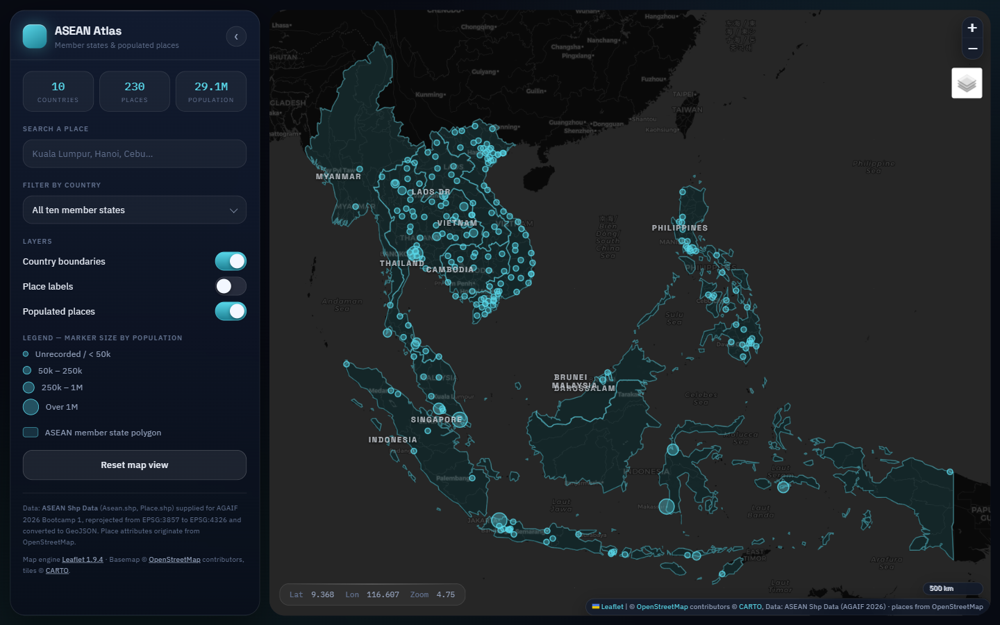
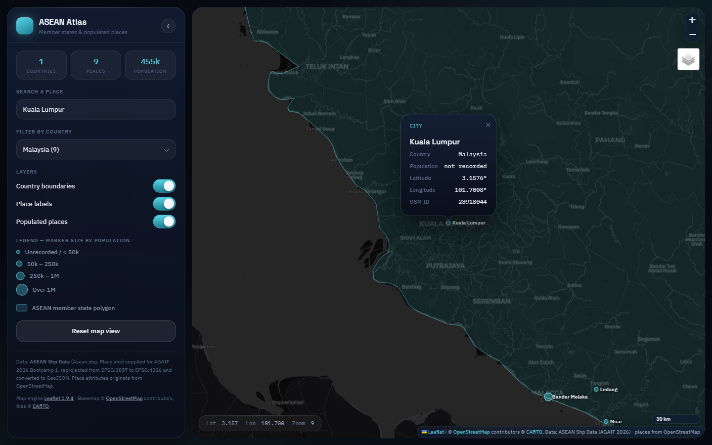

# Certified Assessment 3 — AI-Assisted Interactive Web Mapping Using Leaflet.js

**Programme:** ASEAN GeoAI Fusion 2026 (AGAIF2026) — Bootcamp 1, Day 1  
**Assignment:** CA3 — Document submission  
**Participant name:** CHIN PEI KANG  
**Participant reference code:** MY-637  
**Submission file:** `AGAIF2026_BC1_CA3_MY-637_CHIN PEI KANG.zip`  
**Date:** 24 August 2026  

---

## 1. Summary

I built **ASEAN Atlas**, a browser-based interactive map of the ten ASEAN
member states and 230 populated places, using **Leaflet.js 1.9.4** with plain
HTML, CSS and JavaScript. The map was developed with a generative-AI coding
assistant, then reviewed, corrected and tested by me in the browser.

The application meets every element required by the brief: a base map, correct
display of the supplied geospatial data, labels, zoom/pan, attribute pop-ups,
a data-fitted initial extent, and full attribution.

---

## 2. AI coding tool used

| Item | Detail |
|---|---|
| Tool | **Claude Code** (CLI/IDE agent) running **Claude Opus 5** |
| Vendor | Anthropic |
| Mode of use | Conversational pair-programming: I supplied the assignment brief, the dataset and the design constraints; the assistant read the files, wrote the code, and I reviewed and tested every output |
| Supporting tool | Playwright browser automation (driven by the same assistant) to load the page, check the console for errors, and capture the screenshots |

**Responsible-use note.** The AI was used as a coding assistant, not as an
author of record. I specified the requirements, verified the reprojection
mathematics against known ASEAN coordinates, checked the browser console for
errors, and confirmed every interaction by hand before submitting.

---

## 3. Exact prompts submitted

### Prompt 1 (initial, verbatim)

> read starlink\Pei Kang; and leverage from the code to see what database we can
> use and just generate the requirement for me; then document the "PDF report
> containing:" in an additional .md file for me to put into pdf; also rmb readme
> for the webpage; for the webpage design, make it glassmorphism and iOS style
> theme (match with our current code base towerranger theme and style also ok)

The assignment brief itself (both screenshots of the CollabHub task page —
the assignment text and the Participant Instructions/Remarks) was attached to
this prompt, so the assistant had the full requirement list in context.

### Prompt 2 (follow-up, verbatim)

> the country labels sit in open water for Malaysia and Indonesia — put each
> label on the largest landmass instead

### Standing instruction in the workspace

The repository's `CLAUDE.md` file (the TowerRangers project guide) was in
context throughout. Its design rule — *"cool accent = interface chrome, warm
triad = risk severity, never mixed"*, with the `--ink-*` / `--accent` / glass
tokens defined in `src/frontend/src/index.css` — is what the map's theme was
matched against.

---

## 4. The dataset

**Source:** `ASEAN Shp Data.zip`, supplied by the trainer/Secretariat for
Bootcamp 1 Day 1. It contains two Esri shapefiles plus a spreadsheet copy of
the point layer.

### 4.1 `Asean.shp` — member state polygons

| Property | Value |
|---|---|
| Geometry | Polygon (multi-part; archipelagos) |
| Features | 10 |
| CRS | `WGS_1984_Web_Mercator_Auxiliary_Sphere` (**EPSG:3857**) |
| Attributes | `OBJECTID`, `Country`, `Flag` (ArcGIS Online URL) |
| Countries | Brunei Darussalam, Cambodia, Indonesia, Laos DR, Malaysia, Myanmar, Philippines, Singapore, Thailand, Vietnam |

### 4.2 `Place.shp` — populated places

| Property | Value |
|---|---|
| Geometry | Point |
| Features | 230 |
| CRS | `GCS_WGS_1984` (**EPSG:4326**) |
| Attributes | `osm_id`, `name`, `type`, `population`, `Country`, `Lat`, `Long`, `FID_Asean`, `OBJECTID` |
| Feature types | 220 `city`, 8 `country`, 2 `county` |
| Population field | Populated for part of the dataset only; 0 = not recorded, so the map prints *"not recorded"* rather than "0" |

Places per country: Vietnam 65, Thailand 54, Philippines 33, Indonesia 31,
Cambodia 16, Laos DR 16, Malaysia 9, Myanmar 3, Brunei Darussalam 2,
Singapore 1.

### 4.3 Why this dataset (and what else was considered)

Before settling on the supplied shapefiles, I inspected the datasets already
present in my working repository (`starlink/data/`): the Sunway pilot tower
feature table, and the ITU/ASEAN telecommunications indicator series in
`data/real_sources/`. Those are tabular, country-level and non-spatial in the
form required here, and using them would have needed trainer approval under
instruction 3. The supplied `ASEAN Shp Data` shapefiles are genuinely
geospatial, cover the whole region, and carry the attribute fields the
pop-up requirement calls for — so the assessment map uses the provided dataset
exactly as instructed.

### 4.4 Conversion to a web-compatible format

Leaflet consumes GeoJSON in geographic (lon/lat) coordinates only, so both
layers were converted with a small Python script, `convert_shp_to_geojson.py`
(dependency: `pyshp`):

- `Asean.shp` → `data/asean_countries.geojson` — **reprojected from EPSG:3857
  to EPSG:4326** using the inverse spherical Mercator transform, then written
  as `MultiPolygon` features. 387 KB.
- `Place.shp` → `data/asean_places.geojson` — already EPSG:4326, written as
  `Point` features with the attributes carried through. 58 KB.

Verification of the reprojection: the resulting bounding box is
**92.21°E to 141.01°E, 10.93°S to 28.55°N**, which is the correct real-world
extent of ASEAN. An unconverted Web Mercator file would have produced
coordinates in the millions of metres and rendered nothing.

---

## 5. Application design and features

**Theme.** Dark "instrument glass" — glassmorphism panels with iOS-style
controls (22 px radii, hairline strokes, sliding toggle switches, blurred
translucent surfaces), matched to my existing TowerRangers project theme:
one dark ground (`#070a12`), one cool chrome accent (`#58d6e8`), and warm
colours reserved strictly for data.

| Brief requirement | Implementation |
|---|---|
| Visible base map | Three switchable basemaps — CARTO Dark Matter (default), CARTO Light Positron, OpenStreetMap standard — via the Leaflet layers control |
| Provided geospatial data | Both converted GeoJSON layers rendered: countries as styled polygons, places as population-scaled circle markers |
| Labels / feature names | Permanent country labels (`L.divIcon`), optional permanent place labels, and a hover tooltip on every place marker |
| Zooming and panning | Zoom control, scroll/pinch zoom, drag pan, double-click zoom; clicking a country zooms to its bounds; `maxBounds` keeps the user in-region |
| Information pop-ups | **Place:** name, feature type, country, population, latitude, longitude, OSM ID. **Country:** name, number of places in the dataset, aggregated recorded population |
| Appropriate map view | `map.fitBounds(countryLayer.getBounds())` — the extent is computed from the data, never hard-coded |
| Proper attribution | Leaflet, OpenStreetMap and CARTO in the attribution control, plus a full data-provenance note in the panel footer |

**Additional features** (beyond the brief): a country filter that dims the
non-selected states and re-fits the view; a live place search with keyboard-free
result list that flies to and opens the selected place; three layer toggles;
live latitude/longitude/zoom readout; a collapsible side panel; a responsive
layout that stacks below 900 px.

---

## 6. Source code

Full source is in the submitted ZIP. Files:

| File | Lines | Purpose |
|---|---|---|
| `index.html` | 112 | Page structure, panel markup, Leaflet + stylesheet includes |
| `css/styles.css` | 494 | Glass/iOS theme, Leaflet control restyling, responsive rules |
| `js/map.js` | 524 | All map logic (below) |
| `convert_shp_to_geojson.py` | 117 | Shapefile → GeoJSON conversion and reprojection |

The two mechanisms most worth reading are the reprojection and the data-fitted
extent.

**Inverse Web Mercator (`convert_shp_to_geojson.py`):**

```python
R = 6378137.0  # WGS84 semi-major axis used by EPSG:3857

def mercator_to_wgs84(x, y):
    """Inverse spherical Web Mercator -> (lon, lat) in degrees."""
    lon = (x / R) * 180.0 / math.pi
    lat = (2.0 * math.atan(math.exp(y / R)) - math.pi / 2.0) * 180.0 / math.pi
    return round(lon, 5), round(lat, 5)
```

**Map creation, basemaps and attribution (`js/map.js`):**

```js
var map = L.map("map", {
  zoomControl: false, minZoom: 3, maxZoom: 18,
  center: [6, 116], zoom: 4      // fallback; replaced by fitBounds()
});

var osmAttr = '&copy; <a href="https://www.openstreetmap.org/copyright">OpenStreetMap</a> contributors';
var cartoAttr = osmAttr + ' &copy; <a href="https://carto.com/attributions">CARTO</a>';

L.tileLayer("https://{s}.basemaps.cartocdn.com/dark_all/{z}/{x}/{y}{r}.png",
  { attribution: cartoAttr, subdomains: "abcd", maxZoom: 20 }).addTo(map);

L.control.zoom({ position: "topright" }).addTo(map);
L.control.scale({ position: "bottomright", imperial: false }).addTo(map);
```

**Initial extent fitted to the data:**

```js
state.dataBounds = countryLayer.getBounds();
map.fitBounds(state.dataBounds, { padding: [30, 30] });
map.setMaxBounds(state.dataBounds.pad(1.2));
```

**Place markers, labels and pop-ups:**

```js
var marker = L.circleMarker(latlng, placeStyle(props));
marker.bindPopup(placePopup(props), { maxWidth: 300 });
marker.bindTooltip(props.name, { direction: "top", offset: [0, -6] });
```

---

## 7. Development process

1. **Read the brief and the data.** Unzipped `ASEAN Shp Data.zip` and inspected
   both shapefiles' schema, feature counts, and — critically — their `.prj`
   files, which is where the CRS mismatch showed up.
2. **Chose the dataset.** Reviewed the alternative datasets in my repository,
   confirmed the supplied shapefiles were the right (and approved) choice.
3. **Converted the data.** Wrote `convert_shp_to_geojson.py`, reprojected the
   polygon layer, and validated the output bounding box against known ASEAN
   coordinates before writing any map code.
4. **Built the page.** `index.html` structure → `css/styles.css` theme →
   `js/map.js` behaviour, in that order.
5. **Vendored Leaflet.** Downloaded Leaflet 1.9.4 into `vendor/` rather than
   relying on a CDN, so the extracted ZIP still runs if the marker CDN is
   blocked.
6. **Ran it.** Served the folder with `python -m http.server` and drove the
   page in a real browser.
7. **Tested and fixed** (Section 8), then captured the screenshots and wrote
   this report and the README.

---

## 8. Testing, troubleshooting, and corrections to the AI-generated code

| # | Issue found | Diagnosis | Correction |
|---|---|---|---|
| 1 | Country polygons would not have rendered at all | `Asean.prj` is Web Mercator (EPSG:3857) while `Place.prj` is WGS84 — a mismatch that is easy to miss because the point layer looks fine | Added the inverse-Mercator reprojection to the converter; verified the output bbox is 92.2–141.0°E / 10.9°S–28.6°N |
| 2 | Country labels floated in open water for Malaysia, Indonesia and the Philippines | The first version placed each label at `layer.getBounds().getCenter()`; for an archipelago the bounds centre is sea | Added `largestPartCenter()`, which picks the largest polygon part by bounding-box area and labels that |
| 3 | Population shown as `0` for many places | The dataset uses 0 as "unknown", not "zero people" — displaying it as a fact would be wrong | Pop-up now prints *"not recorded"*, and the legend's smallest bin reads "Unrecorded / < 50k" |
| 4 | Searching for a place hidden by an active country filter opened nothing | The marker had been removed from the map by the filter, so `openPopup()` had no target | `flyToPlace()` now clears the filter and re-enables the places layer before flying to the marker |
| 5 | The map kept its old size when the side panel was collapsed | Leaflet caches container dimensions | `map.invalidateSize()` called after the 320 ms panel transition ends |
| 6 | Opening `index.html` directly showed a blank map | Browsers block `fetch()` on `file://` URLs — a genuine trap for a marker unzipping the folder | Added a visible in-map error message telling the reader to run a local web server, and documented it prominently at the top of `README.md` |
| 7 | Console 404 on `favicon.ico` | No icon supplied | Added an inline SVG data-URI favicon; console is now clean |
| 8 | `fitBounds` left a third of the viewport empty | Leaflet snaps to whole zoom levels by default, so the region fit at z4 when z5 was too tight | Set `zoomSnap: 0.25`, which frames the data at z4.75 |
| 9 | Place names could inject markup | `name` comes from OpenStreetMap, i.e. untrusted text, and was being concatenated into pop-up HTML | Added `escapeHtml()` around every interpolated attribute value |

**Verification performed.** Page loads with zero console errors; all 10 country
polygons and 230 place markers render in the correct real-world positions; the
country filter reduces the visible set correctly (Malaysia → 9 places, matching
the dataset count); place search, pop-ups, tooltips, layer toggles, zoom, pan
and the reset button all behave as intended; and the ZIP was extracted to a
clean folder and re-tested before submission.

---

## 9. Screenshots

**Figure 1 — Full ASEAN extent, all 10 member states and 230 places, fitted
automatically to the data.**



**Figure 2 — Country filter set to Malaysia, place labels on, and the
Kuala Lumpur attribute pop-up open.**



---

## 10. Reflection — what I learned

- **Check the `.prj` before writing any map code.** The single most important
  finding in this assignment was a CRS mismatch *inside one dataset*: the
  polygons were Web Mercator and the points were WGS84. Leaflet expects
  lon/lat, and a Web Mercator GeoJSON fails silently — the layer simply is not
  there. Validating the output bounding box against coordinates I could
  recognise turned a silent failure into a two-second check.
- **AI accelerates the writing, not the judgement.** The assistant produced a
  working Leaflet application quickly, but every one of the eight corrections
  in Section 8 came from looking at the actual rendered map and asking whether
  what I saw was *true*. Labels in the sea and a population of "0" both look
  perfectly fine to a code reviewer and are obviously wrong on a map.
- **Being explicit about the data's meaning matters.** Deciding that `0`
  means "not recorded" rather than "zero" is a cartographic decision, not a
  coding one, and it changed both the pop-up and the legend.
- **Small robustness choices decide whether a submission works on someone
  else's machine.** Vendoring Leaflet instead of using a CDN, and writing a
  clear "you need a local server" message, are what make the extracted ZIP
  behave for an assessor.
- **A consistent design system pays off.** Reusing the token set from my
  existing project meant the theme took minutes rather than hours, and the
  result reads as one coherent product rather than a default-styled demo.

---

## 11. Submission checklist

- [x] `index.html`
- [x] CSS and JavaScript files (`css/styles.css`, `js/map.js`)
- [x] Dataset / GeoJSON files (`data/*.geojson`) plus the conversion script
- [x] PDF report (export this file, `REPORT.md`)
- [x] Screenshots (`screenshots/`, two images)
- [x] README explaining how to open the application (`README.md`)
- [x] ZIP named `AGAIF2026_BC1_CA3_MY-637_CHIN PEI KANG.zip`
- [x] Name and reference code filled in (this report and `README.md`)
- [ ] Extract and re-test the ZIP, then upload via CollabHub before the deadline
