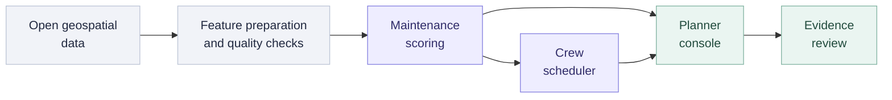

<p align="center">
  
</p>

<h1 align="center">Starlink · TowerRangers</h1>

<p align="center">
  <strong>Turn geospatial evidence into maintenance decisions.</strong><br>
  ASEAN GeoAI Fusion 2026 · Innovation Track · Team HACK-MY-093
</p>

<p align="center">
  <a href="#quick-start">Quick start</a> ·
  <a href="#platform">Platform</a> ·
  <a href="#architecture">Architecture</a> ·
  <a href="#data-and-method">Data &amp; method</a> ·
  <a href="#documentation">Documentation</a>
</p>

---

## Overview

TowerRangers is a geospatial maintenance-planning prototype for Malaysian telecom infrastructure. It brings tower locations, satellite observations, terrain, environmental exposure, and condition signals into one workflow: **detect → decide → dispatch**.

Planners can investigate a site, understand its maintenance priority, review a work order, and assign the right crew. The scheduler accounts for travel, skills, territory, shift capacity, urgency, and seasonal constraints. A feedback workspace keeps observations and review decisions visible after dispatch.

| National dataset | Sunway pilot | Pilot source measurements |
| :---: | :---: | :---: |
| **1,164 tower records** | **132 operator-site records** | **30,925 cellular measurements** |
| OpenStreetMap-derived Malaysian sites | 84 unique coordinate locations | Real 4G/5G observations |

> [!NOTE]
> **Research prototype.** Tower and environmental inputs include real open data; maintenance histories and demonstration telemetry are synthetic. Model evaluation measures performance on that simulated process, not verified real-world failure prediction. See [Data and method](#data-and-method).

## Platform

| Workspace | What it supports |
| --- | --- |
| **Map** · `/map` | Explore tower priorities alongside flood, rainfall, land, fire, and backhaul layers; inspect contributing factors and available observations. |
| **Investigation** · `/investigation` | Review a tower's evidence, condition signals, history, attribution, and recommended intervention. |
| **Tickets** · `/tickets` | Review maintenance tickets, required skills, urgency, and emergency work before scheduling. |
| **Schedule** · `/schedule` | Plan crew visits, inspect routes and assignment explanations, preview overrides, and replan with the assistant. |
| **Close loop** · `/loop` | Inspect the observation ledger, disagreements, contested cases, and confirmation exports. |
| **Simulation** · `/simulation` | Play, pause, and inspect a staged Sabah flood-response scenario with crew, drone, and coverage visualizations. |

### A first walkthrough

1. Open the **Map** and select a tower to inspect its priority and contributing evidence.
2. Continue to **Investigation** to review the proposed intervention and its context.
3. Review the work in **Tickets**, then use **Schedule** to inspect crew assignments and travel.
4. Open an assignment's explanation or preview a manual move to see the scheduling constraints.
5. Explore **Close loop** for evidence review, or **Simulation** for the staged disaster-response demonstration.

## Quick start

**Prerequisites:** Python 3.10+, Node.js 22.12+, npm, and Make. The commands below use a POSIX shell; on Windows, use WSL or a compatible shell and Make installation.

Run from the repository root:

```bash
python3 -m venv src/backend/.venv
. src/backend/.venv/bin/activate
make install
make dev
```

`make install` installs the backend, geospatial, model, and notebook dependencies plus the frontend packages. The core application starts without API keys or an `.env` file; optional integrations are described below.

| Service | Local address |
| --- | --- |
| Application | [localhost:5173](http://localhost:5173) |
| Interactive API documentation | [127.0.0.1:8001/docs](http://127.0.0.1:8001/docs) |
| API health check | [127.0.0.1:8001/health](http://127.0.0.1:8001/health) |

```bash
curl --fail http://127.0.0.1:8001/health
# {"status":"ok"}
```

The frontend calls `/api` on its own origin; Vite forwards those requests to the backend. **Leave `VITE_API_BASE` unset for local development.** To change the backend port, use `make dev BACKEND_PORT=8002`; Make updates the proxy target with it.

For a deterministic synthetic tower population, start with `USE_FIXTURE=1 make dev`. Without that flag, the backend prefers the national feature table and falls back to the Sunway pilot when the national table is absent.

### Optional configuration

When an integration is needed, copy [`src/backend/.env.example`](src/backend/.env.example) to `src/backend/.env` and fill in only the relevant values. Frontend overrides are documented in [`src/frontend/.env.example`](src/frontend/.env.example).

| Capability | Configuration | Without configuration |
| --- | --- | --- |
| Earth Engine imagery | `GEE_PROJECT`, plus developer credentials or `GEE_SERVICE_ACCOUNT_EMAIL` + `GEE_PRIVATE_KEY_FILE` | Previously cached imagery remains usable; unavailable layers report their status. |
| Claude scheduling assistant | `ANTHROPIC_API_KEY` and the optional `anthropic` Python package | A deterministic fallback runs through the same streamed event interface. |
| Durable map cache | `SUPABASE_URL` + `SUPABASE_SECRET_KEY`, after applying the [included migration](supabase/migrations/20260912130043_map_cache_storage.sql) | Map data is cached locally in SQLite. |
| Confluence runbooks | `CONFLUENCE_SITE_URL`, `CONFLUENCE_EMAIL`, `CONFLUENCE_API_TOKEN`; optional `CONFLUENCE_SPACE_KEY` | External runbook retrieval is unavailable. |
| Local cache location | `MAP_CACHE_PATH` | Uses `.cache/maps.sqlite3`. |

For Claude tool calling, install the optional SDK into the same environment:

```bash
src/backend/.venv/bin/python -m pip install anthropic
```

Keep credentials in the backend environment. In particular, never put `SUPABASE_SECRET_KEY` in a `VITE_` variable or commit it to source control; see [Supabase's API-key guidance](https://supabase.com/docs/guides/getting-started/api-keys).

## Architecture



The React client uses one FastAPI backend for tower scoring, scheduling, streamed agent events, and cached map layers. Review observations are recorded separately from training labels; the diagram does not imply automatic retraining.

| Layer | Implementation |
| --- | --- |
| Interface | React 19, TypeScript, Vite, Tailwind CSS, Motion |
| Maps and visualization | MapLibre GL, Three.js, Turf, Recharts |
| Client state and requests | Zustand, TanStack Query |
| API and validation | Python, FastAPI, Pydantic |
| Modeling | NumPy, pandas, scikit-learn, LightGBM |
| Scheduling | Python optimizer, configurable crew and action policies, travel matrices |
| Geospatial processing | Google Earth Engine, open raster and vector sources |
| Map persistence | SQLite; optional Supabase Postgres and private Storage |

## Data and method

### Source-backed inputs

| Dataset | Contents | Reference |
| --- | --- | --- |
| Malaysia | 1,164 tower records with prepared environmental features; the default serving population. | [Feature table](data/malaysia/tower_feature_table.csv) · [Quality report](data/malaysia/quality_report.json) |
| Sunway pilot | 132 anonymous operator-site records derived from 30,925 measurements, enriched with terrain, water, power, and population context. | [Pilot methodology and attribution](docs/PILOT_DATASET.md) |
| Regional source inventory | ASEAN ITU observations, series metadata, catalog inventory, source-to-feature mapping, checksums, and QA. | [Real-source data guide](data/real_sources/README.md) |
| Simulation | Staged disaster-response inputs and demonstration context. | [Simulation data guide](data/simulation/README.md) |

National tower coverage reflects mapped OpenStreetMap features, not a complete operator asset register. Pilot coordinates are source-estimated locations; multiple operators can share a coordinate. Missing fields remain explicit, and population exposure is modeled rather than measured subscriber count.

### How scores become decisions

- **Maintenance risk:** the serving adapter uses the trained LightGBM maintenance model when its artifact and dependencies are available. Otherwise, it falls back to the physical noisy-OR risk index.
- **Dispatch priority:** the ensemble combines the maintenance-risk ranking with a condition ranking when telemetry is available. Priority is a relative ordering, not a failure probability.
- **Attribution and sensitivity:** factor explanations and adjustable weights expose the physical index. The `/score` weight-adjustment route uses that index, so it can differ from the learned score served by `/towers`.
- **Scheduling:** work orders are assigned under crew, territory, travel, shift, urgency, pinned-assignment, and monsoon constraints. Baseline comparisons use the same demand to compare dispatch policies.

The maintenance-history generator and demonstration telemetry are **synthetic**. Reported classification metrics assess the simulated task; stability checks assess ranking sensitivity. Neither establishes real-world predictive accuracy. HAND inundation layers are terrain-threshold scenarios, not calibrated flood-depth forecasts, and the disaster simulation is a staged demonstration.

The current reproducible model work lives in [`maintenance_need.ipynb`](notebooks/maintenance_need.ipynb) and [`ensemble_vs_model.ipynb`](notebooks/ensemble_vs_model.ipynb). Read [Synthetic maintenance labels](docs/SYNTHETIC_MAINTENANCE_LABELS.md) for the generator's assumptions and evaluation boundaries.

<details>
<summary><strong>Rebuild the source datasets</strong></summary>

With the backend environment activated, run the relevant producer from the repository root:

```bash
python3 src/backend/data/prepare_malaysia_dataset.py
python3 src/backend/data/prepare_pilot_dataset.py
python3 src/backend/data/prepare_real_dataset.py
```

These commands regenerate data and can contact external providers. Check each script's `--help` and the linked dataset documentation before refreshing inputs; Earth Engine-backed processing requires its own credentials.

</details>

## Map layers and caching

The console separates **risk attribution** around tower sites from **inundation** on the ground. Available sources include GSMaP rainfall, Sentinel-1/2 and Landsat water observations, NOAA GFS rainfall forecasts, the CEMS GloFAS river outlook, and land and fire overlays. Source windows and limitations are documented in the [Flood forecasting pipeline](docs/FLOOD_FORECASTING_PIPELINE.md).

**Environmental overlays use saved imagery.** Opening the app, changing dates, selecting layers, panning, and zooming do not trigger fresh imagery-provider requests. The map opens the latest saved observation date; missing layers or dates remain explicitly unavailable until a manual reload. This policy applies to the cached overlays; the basemap has its own tile source.

Use **Reload all maps** in the layer panel to fetch a fresh batch for the selected date. GloFAS does not require Earth Engine credentials; Earth Engine-backed layers do. Existing maps remain visible while replacements are prepared.

<details>
<summary><strong>Operations: reloads, credentials, and durable storage</strong></summary>

**Reload behavior**

- `GET /maps/status` reports ready, preparing, and unavailable layers. `POST /maps/preload` records the viewport for a future manual reload.
- `POST /maps/reload?date=YYYY-MM-DD` requests a fresh pass across configured flood, land, and fire overlays, sensors, and all five HAND stages. Repeated clicks coalesce with an active batch.
- Reloads save ASEAN coverage from zoom 0 through 8, within each source's extent. Deeper zooms magnify saved zoom-8 imagery.
- `POST /maps/reload?date=YYYY-MM-DD&resume=true` resumes missing coverage without refetching completed tiles. Changed source observations create a separate snapshot so tiles from different runs do not mix.
- There is no scheduled imagery refresh or age-based deletion. Expired source URLs do not expire saved images; rendering or source changes can invalidate a cache entry.
- Requests are serialized. Temporary network and HTTP 502/503/504 errors receive up to three attempts within a manual batch. HTTP 429 pauses Earth Engine work with persisted backoff from one to 30 minutes, honoring a longer `Retry-After`. Retry manually after the cooldown; cached images remain available.

**Earth Engine setup**

Set `GEE_PROJECT` to a project registered for Earth Engine with its API enabled. For a developer workstation, use `gcloud auth application-default login` or `earthengine authenticate`. For headless use, configure the service-account variables in the backend environment example.

The configured identity needs Earth Engine Resource Viewer, Service Usage Consumer, and `earthengine.maps.create` permission on the compute project. When changing projects, retain `GEE_DSWFP_ASSET_ROOT` if the exported DSWFP assets remain in the original project. Changing the compute project does not move those assets.

**Durable cache**

With Supabase configured, Postgres stores snapshot metadata and checksums; the private `map-cache` Storage bucket stores image bytes. The backend restores metadata on startup and downloads saved images into SQLite on demand. Local images remain available during a cloud outage, and a persistent outbox retries uploads without refetching source imagery.

Apply the [cache migration](supabase/migrations/20260912130043_map_cache_storage.sql) to the intended project before setting `SUPABASE_URL` and a backend `sb_secret_...` key. To import an existing local cache, stop the backend first, then run:

```bash
cd src/backend
.venv/bin/python -m tiles.migrate_cache
```

The importer preserves `maps-before-supabase.sqlite3`, supports reruns, and verifies uploaded images by downloading and checking SHA-256 before publishing snapshots. It does not request new Earth Engine imagery.

Run one backend process for the serial reload queue. The background worker synchronizes saved data; new source coverage still requires a manual reload. Missing DSWFP exports remain unavailable, and caching does not restore exhausted provider quotas.

</details>

## Development

| Command | Purpose |
| --- | --- |
| `make install` | Install backend, model, geospatial, notebook, and frontend dependencies. |
| `make dev` | Start the API and frontend together. |
| `make backend` / `make frontend` | Run either service separately. |
| `npm --prefix src/frontend run build` | Type-check and build the frontend. |
| `npm --prefix src/frontend run lint` | Run the frontend linter. |

Use **Ctrl+C** in the development terminal to stop the foreground session.

Backend tests require pytest, which is installed separately:

```bash
src/backend/.venv/bin/python -m pip install pytest
(cd src/backend && .venv/bin/python -m pytest -q -p no:cacheprovider)
```

Frontend logic checks use Node's built-in test runner and TypeScript stripping:

```bash
cd src/frontend
node --experimental-strip-types --test src/lib/*.test.mjs
```

For a change, run the relevant checks and keep data provenance and API contracts consistent. Additional development notes are in [`CLAUDE.md`](CLAUDE.md); load-test instructions are in [`src/backend/loadtest/README.md`](src/backend/loadtest/README.md).

### Repository layout

```text
starlink/
├── src/
│   ├── frontend/          React planner console and visualizations
│   └── backend/
│       ├── api/           FastAPI routes and response schemas
│       ├── adapter/       Dataset-to-API mapping
│       ├── model/         Risk, condition, priority, and feedback logic
│       ├── scheduler/     Work orders, constraints, routing, and overrides
│       ├── agent/         Tool calling and deterministic fallback
│       ├── data/          Source preparation and synthetic-data producers
│       ├── tiles/         Map rendering, reload queue, and persistence
│       └── config/        Crew, action, and scheduling policies
├── data/                  Prepared datasets, manifests, and source records
├── notebooks/             Training and ensemble evaluation
├── supabase/migrations/   Optional durable map-cache schema
├── docs/                  Methodology, handoffs, and demonstration guides
└── Makefile               Local installation and development commands
```

## Documentation

| Start here | Reference |
| --- | --- |
| Product concept and competition submission | [Concept overview](docs/important/Concept_Overview.md) · [Submission canvas](docs/important/HACK-MY-093_PDGS_v01.md) |
| Demonstration narrative | [Demo script](docs/Demo_Script.md) · [Pitch content](docs/Pitch_Deck_Content.md) |
| Engineering contracts | [Backend handoff](docs/Backend_Handoff.md) · [Frontend handoff](docs/Frontend_Handoff.md) |
| Ticket-to-dispatch workflow | [Ticket and schedule handoff](docs/Ticket_To_Schedule_Handoff.md) |
| Data provenance and assumptions | [Sunway pilot](docs/PILOT_DATASET.md) · [Real-source datasets](docs/REAL_DATASET.md) · [Synthetic labels](docs/SYNTHETIC_MAINTENANCE_LABELS.md) |
| Environmental evidence | [Flood pipeline](docs/FLOOD_FORECASTING_PIPELINE.md) |
| Scenario design | [Disaster simulation specification](docs/Disaster_Simulation_Spec.md) |

Some concept and planning documents describe earlier iterations. The current implementation, manifests, and model reports provide the reference for shipped behavior.

## Acknowledgments

Built by **Team TowerRangers · HACK-MY-093** for **ASEAN GeoAI Fusion 2026**, Innovation Track.

The project uses open data from contributors and providers including OpenStreetMap, Copernicus, the Alaska Satellite Facility, WorldPop, ITU, and the Sunway cellular dataset authors. Dataset-specific attribution, licenses, versions, and limitations are recorded in the [pilot source registry](data/pilot_sunway/source_registry.csv) and [regional source inventory](data/real_sources/README.md).
