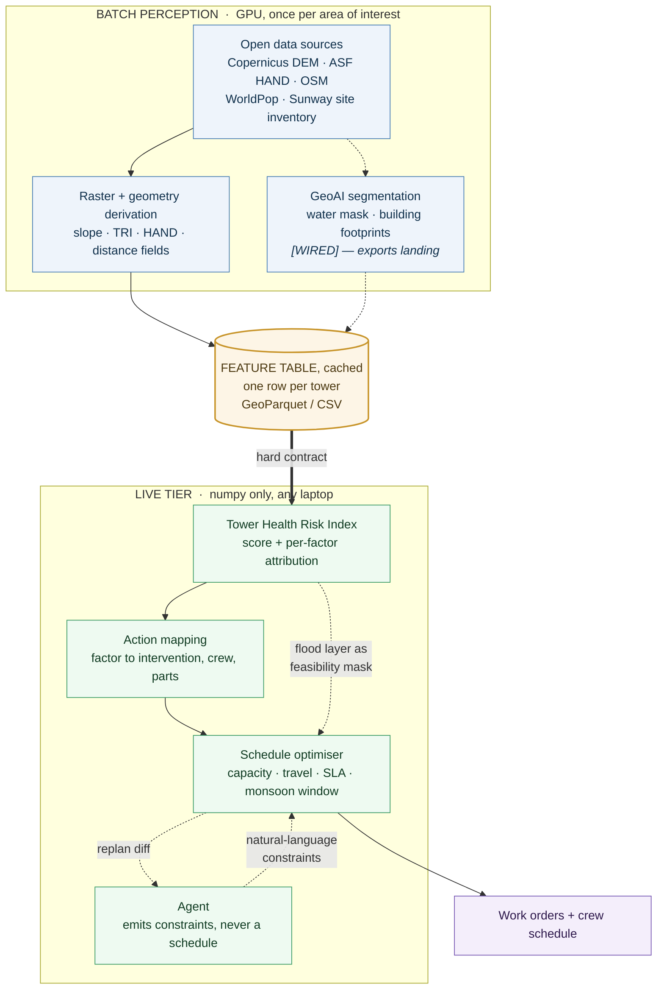

# Problem–Data–GeoAI Solution (PDGS) Canvas

**Team:** TowerRangers · **Team Ref Code:** HACK-MY-093
**Project:** Predictive Maintenance for Telecom Towers (detect, decide, dispatch)
**Event:** ASEAN GeoAI Fusion 2026 · **Innovation track** (predictive maintenance and infrastructure intelligence)
**Version:** v01 · **Submission:** 12 Aug 2026, by 4:00 PM GMT+8

---

## Executive Summary

Cell towers carry no condition sensors, so operators cannot identify fragile sites before one fails. This project derives tower condition indicators from open satellite, elevation, and infrastructure data, combines them into an interpretable Tower Health Risk Index with per-factor attribution, and converts that attribution into a dispatched maintenance schedule. The result is a shift from calendar-based and complaint-driven maintenance to exposure-based, pre-emptive intervention, using open global datasets that require no new data collection.

**How to read this document.** This canvas states the full system design, including the parts still landing. So that ambition is never mistaken for a claim of completion, every capability carries one marker:

> **[BUILT]** running in the repository today · **[WIRED]** interface, contract, and UI in place, output still landing · **[NEXT]** designed, on the roadmap

The spine of the system — **detect → decide → dispatch** — is `[BUILT]`, end to end, on a real feature table for a Malaysian pilot area of interest (Sunway, Selangor; 132 operator-node sites). What remains is depth on the perception tier, not a missing link in the chain.

---

## 1. Problem and Needs Statement

**Cell towers are critical infrastructure with no condition sensors.** Operators cannot see which towers are fragile until one fails.

Tower outages are driven by the environment around the site: flooding, unstable slopes, lightning, and grid dependence. Maintenance is nonetheless scheduled by calendar cycle or by complaint, because no operator holds a geospatial risk profile of its own sites. Four consequences follow.

- **P1 · Reactive repair.** Crews are dispatched after the outage, when access roads may already be cut.
  Sabah floods, July 2024: 41 towers down, **5 unreachable because roads were flooded**. Nationwide 2022: **800+ towers affected** **[1]**. Emergency repairs cost **3 to 5 times more than planned intervention** **[2]**.

- **P2 · Misallocated hardening.** Budgets follow asset age and past incidents rather than exposure. A three-year-old tower in a flood plain is invisible to a calendar-based programme.
  Sept 2025: MCMC ordered **urgent hardening of 11 Sabah towers**, identified only after past flood seasons exposed them **[3]**.

- **P3 · Longest outages hit thinnest coverage.** Rural single-tower areas, where an outage isolates a community, are the slowest to reach.
  Malaysian household internet access: **98.4% urban versus 89.4% rural** **[4]**.

- **P4 · A ranked list is not a decision.** A risk score alone does not state what to fix, how soon, or who to send.
  **Approximately 25% of telecom truck rolls are unproductive**, driven by scheduling, missing parts, wrong skill, and unchecked site access **[5]**.

**The gap:** every driver that matters is observable from open satellite and elevation data, yet exists in no operator table, and nothing today carries it through to a dispatched crew.

### Needs mapped to deliverables

| # | Need | Delivered by |
|---|---|---|
| **N1** | See tower exposure **before the season**, without site sensors | Risk index over remotely-sensed drivers: flood, terrain, equipment, grid **[BUILT]**; lightning once climatology is licensed **[NEXT]** (§4.2–§4.3) |
| **N2** | Rank by **exposure rather than age**, and name the driving mechanism | Noisy-OR scoring with per-factor attribution **[BUILT]** (§4.3) |
| **N3** | Surface the **population actually affected**, including unmapped rural areas, so planners can break ties between equally risky towers | Gridded population exposure per site **[BUILT]**, extended by footprint extraction where map coverage is sparse **[NEXT]** — reported alongside risk, never inside it (§4.2, §4.3) |
| **N4** | Convert the reason a tower is risky into **action, crew, parts, and date** | Agentic Maintenance Scheduler (§4.4) |

**Scope of prediction.** The system predicts **maintenance need, priority, and urgency**: which towers warrant intervention, driven by which failure mechanism, and how soon. It does not predict failure events or failure probabilities, because no public tower-failure dataset exists and no labels are synthesised to produce a figure more precise than the evidence supports. Both are forms of predictive maintenance; only the first is defensible with open data.

---

## 2. Target Users and Beneficiaries

| | Who | What they get |
|---|---|---|
| **Primary user** | Field-maintenance planners at ASEAN operators | What to inspect, why, and when, rather than a score. They currently schedule by calendar or complaint. |
| **Secondary user** | Network-operations planners | Evidence for crew sizing and hardening-capex prioritisation |
| **Direct consumer** | Field crews | A work order carrying action, parts, crew type, and the reason |
| **Tertiary user** | Regulators (for example MCMC) and disaster-management agencies | Auditable infrastructure-resilience measure for service-obligation areas |
| **End beneficiaries** | Subscribers in rural and degraded-coverage areas | Fewer and shorter outages where connectivity is a lifeline service |

---

## 3. Datasets and Data Sources

Every source is **open**, so the pipeline reruns for any area of interest with no new data collection. Sources are separated into those that actually populate the shipped feature table and those that were evaluated and deliberately not used. This separation is machine-readable in `data/pilot_sunway/source_registry.csv`, which carries a `used` flag, licence, and quality note per source.

### 3.1 Powering the pilot today **[BUILT]**

| Layer | Source | Column produced | Licence |
|---|---|---|---|
| Tower sites and radio generation | Urban Multi-Operator QoE-Aware Dataset, Sunway (Mendeley `10.17632/dx5xyyfz2y.1`) | `tower_id`, `lon`, `lat`, `radio` | CC BY 4.0 |
| Terrain | Copernicus DEM GLO-30 via Microsoft Planetary Computer | `slope_deg`, `tri` | Copernicus (free) |
| Hydrological setting | Global 30 m Height Above Nearest Drainage (ASF) | `hand_m` | CC0 1.0 |
| Surface water and grid | OpenStreetMap infrastructure via Overpass | `dist_water_m`, `dist_power_m` | ODbL 1.0 |
| Population exposure | WorldPop R2025A Malaysia 2025 constrained, 100 m | `exposed_pop` | CC BY 4.0 |

**Pilot area of interest:** a ~2 km² window around Sunway University, Selangor, Malaysia; 132 anonymised operator-node sites observed December 2024 to April 2025, across 84 distinct physical site groups. Dense urban rather than rural, chosen because it is the one Malaysian area of interest with an openly-licensed, real, per-site radio inventory.

### 3.2 Assessed, sequenced, and on the roadmap

The full design draws on a wider source set. Each of these was evaluated against the pilot and consciously sequenced rather than quietly dropped — the assessment is machine-readable, with the blocker recorded per source.

| Source | Status | Assessment |
|---|---|---|
| OpenCellID MCC 502 | **[NEXT]** | The ASEAN-scale tower inventory the system is designed around. Bulk export needs a registered API token; the CC BY Sunway dataset resolves the same grain licence-cleanly for the pilot. This is the single unlock for national coverage. |
| Sentinel-2 L2A imagery | **[WIRED]** | Feeds the segmentation stage in §4.2. `dist_water_m` is served by OSM vector geometry until the mask lands. |
| NASA LIS/OTD flash climatology | **[NEXT]** | 0.1° cells cannot discriminate a 2 km area of interest, and download needs an Earthdata login, so `flash_density` is null here and the lightning factor is dropped at runtime rather than imputed. It becomes informative the moment the area of interest is state-sized. |
| Overture Maps buildings | **[NEXT]** | Exposure cross-check against WorldPop. Deliberately a QA layer, not a population substitute. |
| JRC Global Surface Water v1.4 | **[NEXT]** | Sensitivity layer for `dist_water_m` against the OSM-derived distance. |
| GHSL GHS-AGE R2025A | **Rejected** | Not a valid tower-age proxy — surrounding built-stock age is not equipment installation age. `age_years` stays `unknown_not_imputed`. |
| VIIRS night-lights, ESA WorldCover | **[NEXT]** | Grid-dependence refinement and land-cover context, once `dist_power_m` needs more than OSM power geometry. |

A separate directory, `data/real_sources`, holds ITU DataHub ASEAN indicators and the 474-entry geospatial catalogue behind this assessment. It is deliberately **not** a feature table — ITU data is country-level, and no tower coordinates were synthesised to make it resemble one.

### 3.3 Data contract

All perception and feature outputs resolve to one row per tower: coordinates, radio type, `hand_m`, `dist_water_m`, `slope_deg`, `tri`, `flash_density`, `dist_power_m`, `age_years`, and `exposed_pop`, cached as CSV. `check_schema()` in `model/risk_index.py` rejects any table with a NaN in a required column — no silent defaults. `age_years` and `flash_density` are the two declared-absent columns on this area of interest, and both fail loudly rather than being imputed. Nothing is fetched live during the demonstration.

**Declared assumptions, not data.** Crew counts, shift hours, travel speeds, and part lead times are demonstration parameters, declared as assumptions in the user interface, in `config/policy.yaml`, and in this document.

---

## 4. Proposed GeoAI Approach

### 4.1 Core idea: replace the missing sensors with remote sensing

A tower's environment is observable remotely even when the tower itself is not instrumented: the water that floods it, the slope it stands on, and the grid it depends on. Elevation models, hydrological rasters, and open infrastructure geometry convert that environment into condition indicators, and those indicators drive the maintenance decision. This substitution — remote observation standing in for absent sensors — is the reason geospatial data is load-bearing in this system rather than incidental. Imagery segmentation (§4.2) deepens the substitution; it is not what the current build rests on.

```
   detect             ->      decide            ->      dispatch
   Tower Health Index         Action + urgency          Crew schedule
   which towers are           what to fix and           who goes, when,
   fragile, and why           how soon                  with what parts
```

### 4.2 Perception layer

The perception layer has two tiers. Both produce risk drivers that exist in no operator table; everything downstream of them is transparent arithmetic and optimisation.

**Tier 1 — raster and geometry derivation. [BUILT], feeding the index now.**

- **DEM derivatives** from Copernicus GLO-30 over a 3×3 neighbourhood, giving `slope_deg` and terrain ruggedness `tri` as proxies for landslide risk, wind load, and access difficulty.
- **Height-above-drainage** (`hand_m`) sampled per site from the ASF global 30 m HAND product — the dominant flood signal in the model.
- **Infrastructure distance fields** (`dist_water_m`, `dist_power_m`) computed from OSM water and power geometry over the site envelope plus a ~5.5 km buffer.
- **Gridded population exposure** (`exposed_pop`), WorldPop 2025 summed over a 1 km square centred on each site.

**Tier 2 — imagery segmentation. [WIRED]: pipeline, contract, and UI in place; exports landing.**

Pretrained inference via [`opengeos/geoai`](https://github.com/opengeos/geoai):

- **Water segmentation** (OmniWaterMask / U-Net or SAM family) on Sentinel-2, upgrading distance-to-water from mapped vector geometry to *observed* water extent, combined with HAND.
- **Building-footprint extraction** (Mask R-CNN family), giving exposure in the rural zones where no building database exists and gridded population is coarse — the "dark zone" case that motivates N3.
- **Fallback:** text-prompted `GroundedSAM` or `CLIPSegmentation` if a model is unavailable.

The application ships a dedicated **Perception** view built against the real pipeline output shape, each stage rendered as a labelled step with pending output marked as such. That is a deliberate product rule, applied system-wide: the same pattern governs offline data fallback, where a visible banner always fires rather than silently serving fixtures. A demonstration narrated as live while quietly showing stand-in data is worse than a visible gap.

**The chain does not depend on Tier 2 landing.** The flood pathway that dominates the index (§4.6, ablation) is carried by HAND, a hydrologically-derived raster. Tier 2 sharpens an input the model already consumes — it is depth on a working load path, not a missing one.

### 4.3 Layer 1: Tower Health Risk Index (detect)

Label-free, physics-based, and interpretable:

1. **Membership functions.** Each raw factor maps to a failure contribution `p ∈ [0,1]` through a monotonic curve with a physically justified shape. Flood risk, for example, rises steeply as height-above-drainage falls below approximately 5 m, then saturates. These are not linear min-max scalings.
2. **Noisy-OR combination:** `Risk = 1 − Π(1 − pᵢ·wᵢ)`, the probability that at least one driver triggers failure. It is bounded and monotonic, and **any single severe factor dominates**, which matches weakest-link failure behaviour. A weighted average would incorrectly average a new tower in a severe flood zone down to "safe".
3. **AHP weights** (Saaty pairwise over flood, terrain, lightning, equipment, power). The shipped matrix has **consistency ratio 0.0038**, far inside the CR < 0.1 requirement, asserted in the test suite. Weights are rescaled so the maximum is 1, because in a noisy-OR each `wᵢ` is a *cap on a factor's maximum contribution*, not a share of a budget; a sum-to-one vector would compress the whole output range. Weights are documented rather than hand-tuned.
4. **Per-factor attribution** (leave-one-out), for example: `Tower MY_1042: 0.82 (flood 0.41, power 0.28, terrain 0.19, equipment 0.12)`.

Scores resolve into a **maintain / watch / OK** band with an associated urgency.

**Factors active on the pilot area of interest.** Four of the six factors carry signal here: flood (cap weight 1.00), power and equipment (0.54 each), terrain (0.29). **Lightning is dropped at runtime** because `flash_density` is entirely null over this area of interest (§3.2), and **age is dropped** because no honest per-tower installation date exists. Neither is imputed to keep a column populated. The factor set is data-driven, and the code reports which factors were active rather than assuming all six.

**Likelihood and consequence are kept separate.** `risk` answers how likely a tower is to fail, covering hazard and vulnerability only. `exposed_pop` answers how much it matters if it does. Folding population into the noisy-OR would conflate the two and render the score uninterpretable, so exposure is reported as its own column and drawn as its own map layer. Where the two must be combined for ordering, the combination is explicit and visible:

```
priority = risk × log1p(exposed_pop)     # tie-break for dispatch order; never the risk score
```

The two questions, whether a tower is fragile and whether it matters, are therefore answered by two separate numbers.

**A learned second opinion sits alongside the physics. [BUILT]** A maintenance-decision classifier (logistic regression, selected over a random forest and a prevalence baseline) ships as a versioned artefact, validated by 3-fold `StratifiedGroupKFold` grouped on rounded physical coordinate, so co-located operator nodes at one site never straddle a fold. Out-of-fold: **ROC AUC 0.974, average precision 0.945, balanced accuracy 0.892.** It gives the index a fast second opinion and flags model-versus-policy disagreement per row — the seam where a learned view and the physics view part company, which is exactly where a planner should look.

**What that number is, stated by us rather than left to be found:** the target is **policy-generated, not observed** — `MAINTENANCE` means technical risk at or above the cutoff for a configured capacity share, not a maintenance event that occurred, and never a failure. The classifier recovers a decision surface from a restricted feature set (exposure deliberately excluded), so the AUC evidences a *learnable, consistent* policy, not accuracy against reality. That definition travels inside the artefact metadata beside the metrics, so it cannot be quoted out of context. **No failure label is fabricated anywhere in this project** — and when operator outcome data arrives, this is the component that absorbs it (§5, calibration path).

### 4.4 Layer 2: Agentic Maintenance Scheduler (decide and dispatch)

**Attribution is the hinge.** A tower that is risky because of flood needs drainage and a raised cabinet, requiring a civil crew and weeks of lead time. The same score driven by equipment generation needs a radio refresh and a capex line. Identical score, different crew, different parts, different timeline.

- **Action mapping.** A deterministic lookup from dominant factor to intervention, crew type, parts, and lead time. The `why` string is copied verbatim from attribution, so the explanation chain runs unbroken from raw DEM pixel to the sentence a crew reads.
- **Schedule optimiser.** The objective is `minimise Σ priority × days-until-serviced + λ·travel`, where `priority = risk × log1p(exposed_pop)`. It is solved by a **greedy bin-packer, not a global optimiser**: work orders are sorted by priority × urgency and packed into crew-days with nearest-neighbour routing from each crew's depot. This is a deliberate ship-now tier — `O(n log n)` sort plus `O(n × crew-days)` placement, always terminates, and every placement is explainable as a sequence of filter decisions. It claims a *better* schedule than the status quo, never an optimal one.
- **Hard constraints, none optional.** Territory coverage, depot range (haversine × road factor ≤ the crew's maximum travel), crew-type match, jobs-per-crew-day capacity, the SLA deadline carried by `urgency_days`, pinned assignments placed first, and a **monsoon weather window** blocking civil crews from flood-zone towers in November–March. The monsoon mask re-reads the index's own flood attribution — a tower is in the flood zone if flood is its dominant factor or its flood share exceeds a configured threshold. **This is the point at which the two layers interlock rather than merely chain**, and it is implemented, not aspirational.
- **Unscheduled work is returned explicitly**, never silently dropped, so a schedule that cannot absorb the demand says so.
- **Agent.** The LLM performs only the task no solver can: converting a planner's sentence, such as "the Kelantan road is washed out", into a constraint, and explaining what changed after a replan. It is confined to four typed tools — `score_towers`, `propose_actions`, `optimize_schedule`, `apply_constraint` — and reports their return values verbatim rather than restating them in its own words. **The model never emits a schedule; it emits constraints, and the solver emits the schedule.** When no API key is present, a deterministic fallback path drives the same tools and emits the same event vocabulary, so the demonstration cannot fail on model availability.

### 4.5 Architecture



Perception is precomputed, so a weight slider can be adjusted and both the ranking and the schedule update instantly, and no live model failure can interrupt the demonstration. The dotted edge from the index to the scheduler is the interlock described in §4.4: the same flood layer that raises a tower's risk also constrains when that tower can be serviced.

### 4.6 Evidence: two claims, two kinds of proof

The two layers sit in different epistemic positions, and each claim is matched to the evidence that supports it.

**The index does not claim accuracy.** With no failure labels there is no ground truth, so the claim is **robustness**: the ranking is not an artefact of the arbitrary choices. Measured results, reproducible via `python model/validate.py`:

| Perturbation | Spearman ρ vs baseline ranking (median, 5–95%) | Top-decile retention |
|---|---|---|
| Weights, N = 500, lognormal σ = 0.25 | **0.990** [0.927, 0.998] | **91.9%** |
| Membership curve knots, N = 200, ±30% | **0.993** [0.986, 0.999] | **95.2%** |

**Ablation confirms the factor set is not padding.** Dropping flood collapses the ranking (ρ = 0.40, top-decile retention 12%) — it is genuinely load-bearing. Dropping power (ρ = 0.95), equipment (0.97), or terrain (0.99) shifts the ranking measurably but not structurally. Dropping lightning changes almost nothing (ρ = 0.996), which independently corroborates the §3.2 decision to exclude it on this area of interest rather than merely excusing it.

*Read correctly:* stability is measured over a 500-row schema-conformant synthetic table, because 132 sites in one dense-urban window cannot exercise the ranking's tail. This tests the **estimator**, not the pilot data — and the curves, weights, and combination rule under test are the shipped ones.

**The scheduler does claim a number.** Comparing two dispatch policies on identical demand is a policy comparison rather than a fabricated label. Both policies run through the same optimiser, the same crew roster, the same work orders, and the same hard constraints; the *only* difference is the sort key — risk × exposure × urgency versus nearest-depot-first. That is what makes "at identical crew capacity" true rather than asserted: **risk-weighted response time reduced X% versus nearest-first dispatch.**

---

## 5. Expected Outcomes, Impact and Scalability

### Deliverables

1. Ranked tower-risk table with uncertainty band, per-factor attribution, and exposed population as a separate column. **[BUILT]**
2. Interactive map showing risk and exposure as **two toggleable layers**, with a per-tower breakdown, recommended action, parts, and scheduled date. **[BUILT]**
3. Work order per at-risk tower: action, crew type, parts, urgency, and the attribution sentence justifying it. **[BUILT]**
4. Crew schedule (crew × day) with agent chat for natural-language constraints and replan diffs. **[BUILT]**
5. Rank-stability figure and the policy-comparison metric. **[BUILT]**
6. Perception proof view: imagery → mask → feature, stage by stage. **[WIRED]**

### Impact

- **Shifts maintenance from reactive to pre-emptive**, enabling inspection before the monsoon rather than after the outage.
- **Redirects capex by exposure rather than by age**, surfacing the new tower in a flood plain that calendar inspection misses entirely.
- **Closes the loop to action**, so risk becomes a dispatched crew with the correct parts rather than a report.
- **Reduces outage duration in rural areas**, where a single failure isolates a community.
- **Provides regulators with an auditable resilience measure** for service-obligation areas.

### Regional fit

The system is anchored on two Malaysian references, deliberately serving different purposes.

- **Index area of interest: Sunway, Selangor** — the one Malaysian window with an openly-licensed, real, per-site radio inventory (§3.1). Dense urban, so it exercises the equipment, power, and terrain pathways on genuine data while compressing the flood pathway's range, since the whole window sits near drainage level.
- **Scheduler configuration: Kelantan** — crew roster, depots, territories — because the northeast monsoon (November to March) is what gives the weather-window constraint teeth. That seasonality re-enters as a hard constraint: no civil work dispatched to flood-zone towers during monsoon.

The split demonstrates the architecture rather than straining it: the feature table is a contract, so an area of interest is a bounding box and a crew network is a JSON file. Running the index over Kelantan needs a licensed tower inventory for that state — the OpenCellID unlock in §3.2 — not a code change.

### Scalability

- **Zero new data collection.** Every input is open, and the terrain, hydrology, infrastructure, and population layers are global — the pipeline reruns for any ASEAN Member State by changing a bounding box. The one input that is not globally free at the tower grain is the site inventory itself, which needs an OpenCellID token or an operator table (§3.2).
- **Cheap to refresh.** Feature preparation runs once per area of interest and is cached; scoring and scheduling are numpy-only, run on any laptop, and re-run in seconds, so risk can be updated seasonally or after a flood event. Weight sliders re-rank and re-schedule live because nothing behind them needs a model call.
- **Transferable beyond telecom.** The hazard and vulnerability structure applies unchanged to substations, water pumps, clinics, and road assets.
- **Operator-extensible.** If an operator supplies even sparse real outage records, the same weights can be calibrated by weak supervision, an upgrade path that does not require rebuilding the system.

---

## 6. Track Alignment: Innovation

The Innovation track calls for advancing **network planning and maintenance through geospatial intelligence**, naming predictive maintenance and infrastructure intelligence. This project matches that description directly: maintenance decisions derived from geospatial deep learning, for an asset class with no condition telemetry. The work also touches **Efficiency**, since field-force optimisation and workflow automation are what the scheduling layer performs, but the centre of gravity is the substitution of remote sensing for absent sensors, so the submission is entered under Innovation.

---

## 7. Limitations

Stated as the boundary of the claim, not as hedging — each one has a named path across it.

**Data:** open sources are proxies, not asset records — measurement-derived site positions, a 30 m DSM, radio generation as an equipment proxy. Two contracted columns are absent here and are dropped rather than imputed (`flash_density`, `age_years`). Handled by never relying on a single factor and by failing loudly on missing data.

**Coverage:** the index runs on 132 real sites in one ~2 km² dense-urban window, so the flood factor's range is compressed. Scaling is a licensing unlock (an OpenCellID token), not an engineering rebuild — the feature table is a contract and the area of interest is a bounding box.

**Perception:** Tier 2 segmentation is wired, not yet exporting (§4.2). Observed water extent and footprint-derived rural exposure are roadmap, and the interface marks them pending rather than rendering stand-ins.

**Method:** no failure labels exist, so we claim robustness, not accuracy. Rank stability proves the ranking is not arbitrary; it does not prove the weights are right. The classifier's 0.974 AUC measures recovery of a policy rule, not prediction of reality (§4.3). Correctness needs operator outcome data — the stated calibration path.

**Optimisation:** the solver is greedy. It beats nearest-first dispatch under identical constraints; it does not claim the best achievable schedule. The objective and constraints are already expressed in the form an exact solver would consume.

**Scope:** crew counts, shift hours, travel speeds, and lead times are demo assumptions in `config/policy.yaml`, so the claim is the policy *delta*, not absolute timings.

**In short:** a transparent, auditable risk index with a dispatch layer — not a validated failure predictor.

---

## 8. Illustrative Scenario

The highest-risk site in the pilot area of interest carries 5G equipment, so an age-driven programme would rank it last. Its dominant factor is **flood** — it sits essentially at drainage level (HAND ≈ 0 m) within 270 m of mapped water — and roughly 8,000 people fall inside its 1 km exposure square. The recommendation is therefore drainage works and a raised cabinet, a civil crew, and an urgency band rather than a queue position. If the scheduled window falls inside the November–March monsoon, the optimiser refuses to place that civil crew and says so, because the same flood signal that raised the score also closed the work window. Adjusting the weight sliders leaves the ranking substantially unchanged (§4.6).

Predictive maintenance for towers that were never instrumented: the system identifies what calendar-based inspection misses, and converts that finding into a dispatched intervention.

---

## References

Numbered in order of first citation. The right-hand column shows where each is used in §1.

| # | Reference (APA 7) | Used in |
|---|---|---|
| **[1]** | BERNAMA. (2024, July 2). *Sabah floods: MCMC restores 14 telecommunications towers*. https://www.bernama.com/en/news.php?id=2313715 | **P1** — 41 towers down, 5 unreachable via flooded roads |
| **[2]** | Crljen, T. (2025, September 17). *How predictive maintenance drives cost savings*. WorkTrek. https://worktrek.com/blog/predictive-maintenance-cost-savings/ | **P1** — emergency repair costs 3–5× planned |
| **[3]** | BERNAMA. (2025, September 26). *Fahmi: 11 Sabah west coast telecom towers to get urgent site hardening ahead of monsoon*. Malay Mail. https://www.malaymail.com/news/malaysia/2025/09/26/fahmi-11-sabah-west-coast-telecom-towers-to-get-urgent-site-hardening-ahead-of-monsoon/192521 | **P2** — hardening list built only after past floods |
| **[4]** | Amir, S. K. (2026, March 24). *Malaysia's approach to digital justice: Internet access as a human right*. OpenGlobalRights. https://www.openglobalrights.org/malaysias-approach-to-digital-justice-internet-access-as-a-human-right/ *(citing Department of Statistics Malaysia, ICT Use and Access by Individuals and Households Survey Report 2023)* | **P3** — 98.4% urban vs 89.4% rural access |
| **[5]** | Innover Digital. (n.d.). *Truck roll optimization insights for a leading US-based telecom major*. Retrieved August 12, 2026, from https://www.innoverdigital.com/success-stories/truck-roll-optimization-insights-for-a-leading-us-based-telecom-major/ | **P4** — ~25% of truck rolls unproductive |
